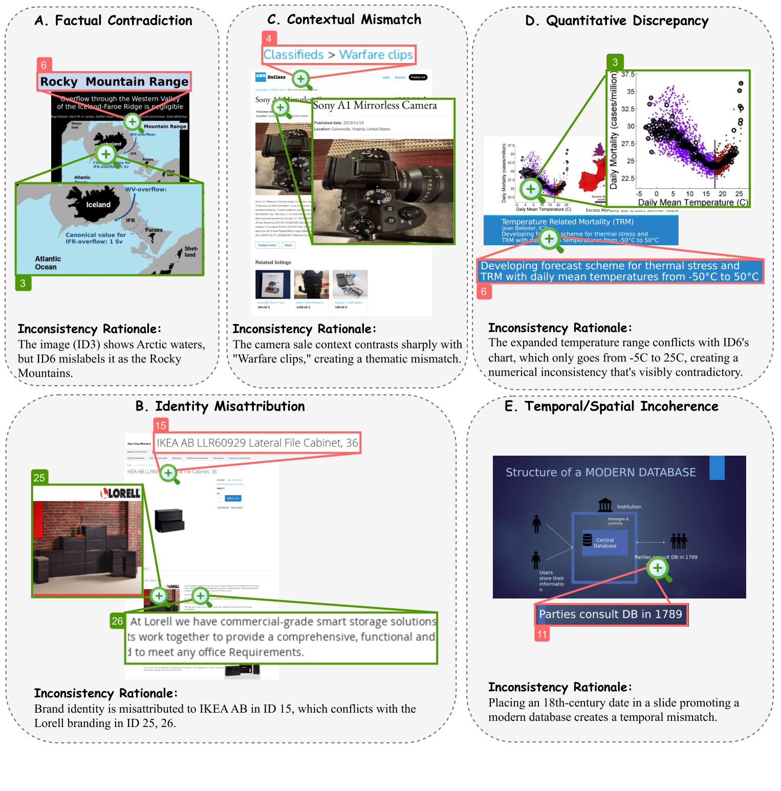

# MMIR

[**🌐 Homepage**](https://jackie-2000.github.io/mmir.github.io/) | [**🤗 Dataset**](https://huggingface.co/datasets/rippleripple/MMIR) | [**📖 Paper**](https://openreview.net/pdf?id=u0Az8rCAoZ) | [**GitHub**](https://github.com/eric-ai-lab/MMIR/)


This repo contains the evaluation code for the paper "Multimodal Inconsistency Reasoning (MMIR): A New Benchmark for Multimodal Reasoning Models".


## Introduction
We introduce MMIR, the first benchmark for evaluating Multimodal Large Language Models (MLLMs) on detecting and reasoning about inconsistencies in layout-rich multimodal content. MMIR features 534 challenging samples across five reasoning-heavy inconsistency categories:
Factual Contradiction, Identity Misattribution, Contextual Mismatch, Quantitative Discrepancy and Temporal/Spatial Incoherence.



## Dataset Creation

The MMIR benchmark was meticulously constructed through a four-stage curation pipeline to ensure high-quality, diverse, and challenging test cases. Please refer to our huggingface [**🤗 Dataset**](https://huggingface.co/datasets/rippleripple/MMIR) for more details.

## Evaluation
Please refer to our [eval](eval)
 folder for more details.

## 🏆 Leaderboard
## 🏆 Leaderboard

| Model               | Web (Open-ended) | Office (Open-ended) | Poster (Open-ended) | Overall (Open-ended) | Web (MCQ) | Office (MCQ) | Poster (MCQ) | Overall (MCQ) |
|--------------------|:----------------:|:-------------------:|:-------------------:|:--------------------:|:--------:|:-----------:|:-----------:|:-------------:|
| o1 (1217)           | **47.91**        | **59.19**           | **38.73**           | **51.40**            | **47.91**| **58.52**   | **46.47**   | **52.15**     |
| GPT-4o (1120)       | 25.00            | 42.60               | 30.98               | 33.14                | 37.29    | 58.96       | 47.88       | 47.75         |
| Qwen2.5-VL-7B       | 8.54             | 29.14               | 11.97               | 17.60                | 14.37    | 33.18       | 16.90       | 22.56         |
| LLaVA-NeXT-7B       | 10.20            | 21.97               | 7.04                | 14.70                | 11.45    | 25.33       | 5.63        | 16.47         |
| InternVL2.5-8B      | 7.70             | 24.21               | 4.92                | 14.23                | 9.37     | 23.54       | 11.97       | 15.63         |
| Phi-3.5-Vision-4B   | 6.87             | 24.43               | 7.04                | 14.23                | 1.66     | 8.52        | 0.00        | 4.30          |


## Contact
- Qianqi Yan: qyan79@ucsc.edu
- Xin Eric Wang: xwang366@ucsc.edu

## Citation

**BibTeX:**
```bibtex
TBD
```
